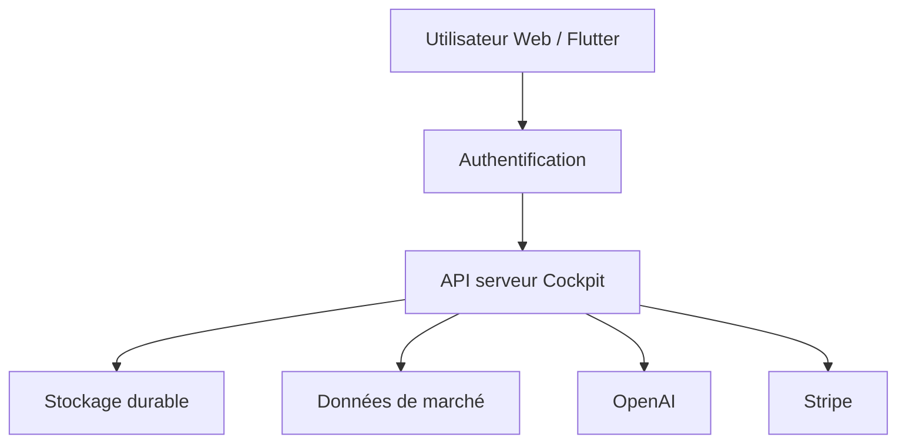

# Architecture

## Vue d'ensemble

Le dépôt contient une application web Next.js 16/React 19 exécutée avec Vinext/Cloudflare selon la cible, et un client Flutter dans `mobile/`.

## Couches

| Couche | Emplacement | Responsabilité |
| --- | --- | --- |
| Interface web | `app/`, `components/`, `hooks/` | Vitrine, cockpit, compte et administration |
| API serveur | `app/api/` | Authentification, validation, droits, orchestration et réponses privées |
| Domaine | `lib/` | Entitlements, identité, IA, marché, facturation et synchronisation |
| Persistance | `db/`, `db/migrations/` | Schéma et migrations versionnées |
| Mobile | `mobile/` | Client Flutter consommant les contrats serveur |
| Validation | `tests/`, `.github/workflows/` | Tests de contrats, build et garde-fous Web/Flutter |

## Identité et hébergements

- Vercel : Auth0 et Neon/Postgres.
- ChatGPT Sites : identité ChatGPT et ressources Cloudflare déclarées par la cible.
- Les adaptations propres à un hébergeur doivent rester isolées. Les fonctions partagées doivent conserver une parité contrôlée, sans écraser l'authentification ou le stockage spécifique.
- L'identité stable est résolue côté serveur avant toute lecture ou écriture personnelle.

## Autorisation

Les rôles sont `USER`, `SUPPORT`, `ADMIN`; les packs sont `DISCOVERY`, `PRO`, `EXPERT`; les statuts sont `TRIALING`, `ACTIVE`, `PAST_DUE`, `CANCELED`, `SUSPENDED`. `lib/entitlements.ts` constitue la politique applicative de référence. Toute route sensible doit appeler l'autorisation serveur et ne retourner que les données de l'utilisateur ou du rôle admis.

## Données

`db/schema.ts` définit notamment profils, abonnements, droits, compteurs, audit, watchlist, notifications, appareils, paper trades, notes et état de travail. Les migrations sont additives et versionnées. Une Preview ne doit jamais migrer implicitement la base de production. Aucune solution mémoire ou `localStorage` ne remplace la persistance durable.

## Intégrations externes

- OpenAI : clé propriétaire conservée et chiffrée côté serveur ; quotas réservés atomiquement ; contexte borné ; erreurs neutralisées.
- Stripe : Checkout/portail initiés côté serveur ; webhook signé puis abonnement relu chez Stripe ; seuls prix et statuts reconnus modifient les droits.
- Marchés/actualités : les adaptateurs doivent exposer fraîcheur et indisponibilité ; pas de données synthétiques présentées comme réelles.

## Frontières de confiance

Le navigateur et Flutter sont non fiables. L'API valide schéma, identité, origine, droit et limite avant effet. Les secrets restent dans l'environnement ou le stockage chiffré. Les réponses personnelles utilisent un cache privé ou `no-store`. Les actions administratives sont limitées, protégées et auditées.

## Déploiement

La branche de travail passe par PR et Preview. Vercel et ChatGPT Sites sont deux livraisons distinctes décrites dans `docs/DUAL-PUBLICATION.md`. Une validation d'une cible ne prouve pas la parité de l'autre. La production nécessite une autorisation explicite.
